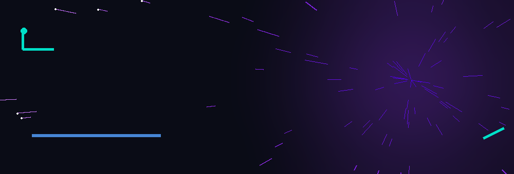

<!-- ====== HERO BANNER (animated GIF) ====== -->

<!-- ====== TYPING INTRO ====== -->

---

<!-- ====== CONNECT + VISUAL ====== -->
<table>
<tr>
<td valign="top" width="54%">
<h3>🔗 Connect with me</h3>

💡 Open to data science internships & collaborations

</td>
<td valign="middle" width="46%" align="center">

</td>
</tr>
</table>

---

## 🚀 About Me

🚀 I'm an **M.Sc. Data Science** student at the **University of Europe for Applied Sciences, Potsdam** — turning raw data into meaningful insight and building ML & LLM-powered projects.

**🔬 I specialize in:**

- 📊 **Data Analysis & Business Intelligence**
- 🤖 **Machine Learning & AI**
- 💬 **Natural Language Processing (NLP)**
- 🧠 **LLM applications** — Groq & LLaMA APIs, prompt engineering
- 📈 **Predictive modeling** with pandas & scikit-learn

 

- 🌱 Currently learning **end-to-end ML workflows** and building data apps with **Streamlit**
- 🌍 Languages: English (fluent) · German (A2, learning) · Tamil (native)
- 📫 Reach me: **ashtagayathri@gmail.com**

---

## 🛠️ Tech Stack

### Languages

### Data Science & ML

### NLP & LLMs

### Tools & Platforms

---

## 📌 Featured Projects

| Project | Description |
| :--- | :--- |
| 🏦 [**german-credit-risk-analysis**](https://github.com/Gayathri-hub-cell/german-credit-risk-analysis) | Machine learning project predicting loan credit risk using Python & scikit-learn *(in progress)* |
| 🤖 [**llm-projects**](https://github.com/Gayathri-hub-cell/llm-projects) | Python projects using LLMs via the Groq API — including a **voice-command intent classifier** and test-result analysis |
| 📊 **Data Visualization Projects** | Exploratory data analysis and charts built in Jupyter |

---

## 🎥 Demo

https://github.com/user-attachments/assets/9931c202-bf5b-4561-856d-408c7a859b85

---

## 📊 GitHub Stats

 

---

## 🏆 GitHub Trophies

---

## 📈 Contribution Graph

---

### 💜 Thanks for stopping by — let's connect!

